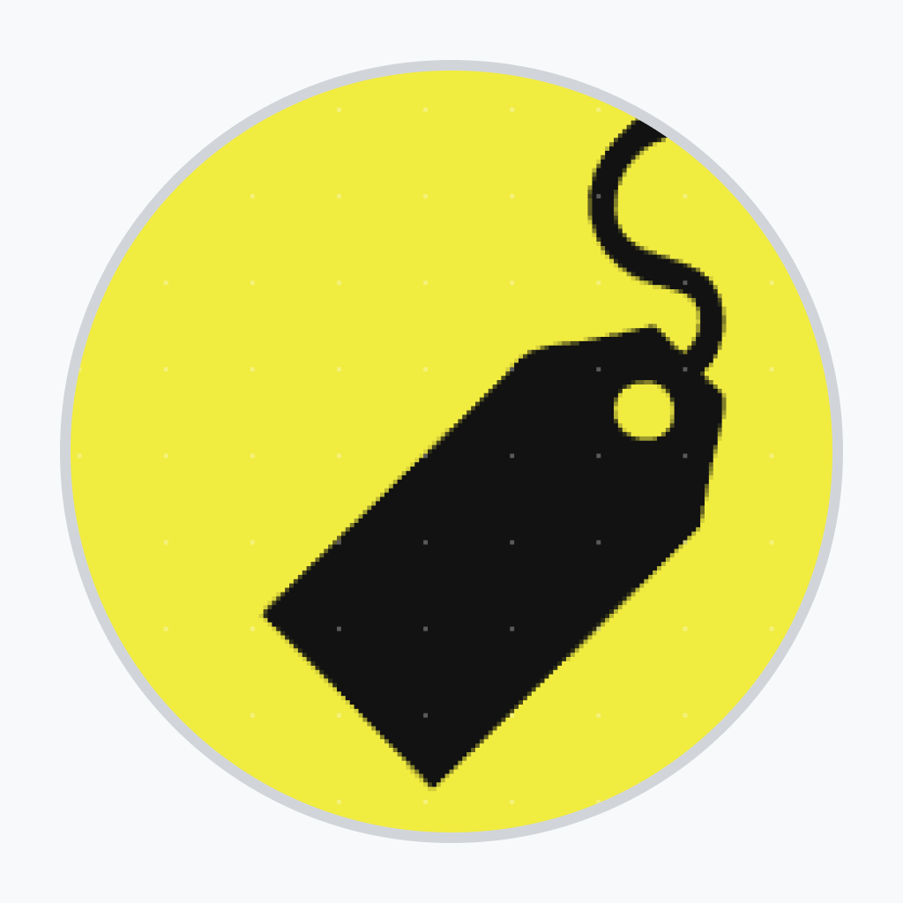

# 🛒 Wagon — Mobile E-Commerce & Merchant Platform

<p align="center">
  
</p>

<p align="center">
  <strong>A modern, full-stack, cross-platform mobile e-commerce application with dynamic buyer and seller experiences.</strong>
</p>

<p align="center">
  
  
  
  
  
</p>

---

## 📖 Overview

**Wagon** is a comprehensive mobile commerce ecosystem engineered with **React Native**, **Expo**, and **Supabase**. It provides a unified codebase that delivers two tailored application flows based on user role:

1. **Buyer / Customer Experience**: A smooth shopping journey featuring masonry product feeds, category hierarchies, keyword search with caching, parallax product views, variant configurators, dynamic carts, multi-address checkout, and direct merchant messaging.
2. **Seller / Merchant Dashboard**: A merchant operations portal equipped with sales analytics, time-series revenue charts, category breakdown pie charts, multi-step product creation with image uploads, inventory controls, and customer chat inbox.

The application is styled with a bespoke earth-toned palette (walnut, chestnut, aged oak, and brass accents) and incorporates micro-animations, smooth transitions, and offline network state detection.

---

## ✨ Key Features

### 🛍️ Customer Experience

- **Dynamic Masonry Home Feed**: Product grid using `@react-native-seoul/masonry-list` with promotional carousels, real-time scroll header animations, and pull-to-refresh.
- **Hierarchical Category Exploration**: Multi-level category browsing powered by Material Top Tabs with subcategory image grids.
- **Instant Search & History**: Fast search with keyword suggestions, persistent search history via `AsyncStorage`, and category-based result filtering.
- **Rich Product Detail View**: Parallax scrolling header, fullscreen gallery view (`react-native-gallery-preview`), interactive variant selector (color swatches, sizing, dimensions), customer review highlights, and related product carousels.
- **Interactive Cart & Multi-select**:
  - Bulk select / individual item selection.
  - Live subtotal and discount calculations.
  - Variant adjustment modal directly inside the cart.
  - Deletion confirmations and item count adjusters.
- **Checkout & Address Management**: Multi-address management with preferred default addresses and direct order submission.
- **Real-Time Customer Support Chat**: Direct messaging interface connected to the seller with automated timestamping and chat bubbles.
- **User Account & Profile**: Account customization (username, avatar, email), password changes, and order history access.

### 📊 Seller & Merchant Experience

- **Role-Based Navigation**: Seamless detection of seller privileges upon login (`seller@wagon.com`), adapting bottom tabs and screens for merchant tools.
- **Interactive Business Analytics**:
  - **Sales Growth Line Chart**: Switchable time periods (Daily, Weekly, Monthly, Quarterly, Annual) with smooth bezier curves.
  - **Inventory & Target Progress Chart**: Visual rings for sales volume vs. stock inventory targets.
  - **Category Distribution Pie Chart**: Breakdown of sales performance across product lines.
- **Multi-Step Product Publishing Wizard**:
  - Step-by-step progress tracking with `react-native-progress`.
  - Multi-image selection from camera roll (`expo-image-picker`) and direct upload to Supabase Storage with Base64 encoding.
  - Multi-variant attribute assignment (sizes, colors, custom dimensions, materials, and inventory quantities).
- **Product Inventory Management**: Expandable product cards to view, update, or remove live listings.
- **Merchant Message Center**: Dedicated inbox for customer inquiries and real-time conversation handling.

### 🛡️ System & Architecture

- **Offline & Connectivity Detection**: Global network provider using `@react-native-community/netinfo` with offline retry screens.
- **Supabase Authentication & Lifecycle**: Persistent session storage with `AsyncStorage` and automatic token refreshing on app state changes (`AppState`).
- **Strict TypeScript Types**: Fully typed navigation routes, database entities, cart items, and component props.

---

## 🛠️ Tech Stack

| Domain                 | Technologies & Libraries                                                                              |
| :--------------------- | :---------------------------------------------------------------------------------------------------- |
| **Framework**          | [React Native](https://reactnative.dev/) (v0.74.5) & [Expo](https://expo.dev/) (SDK 51)               |
| **Routing**            | [Expo Router v3](https://docs.expo.dev/router/introduction/) (File-based, typed routes)               |
| **Language**           | [TypeScript](https://www.typescriptlang.org/) (v5.3)                                                  |
| **Backend & DB**       | [Supabase](https://supabase.com/) (PostgreSQL, Real-time DB, Auth, Storage)                           |
| **State Management**   | React Context API (`AuthContext`, `CartProvider`, `AddressProvider`, `NetworkContext`)                |
| **Data Visualization** | `react-native-chart-kit`, `react-native-segmented-control-tab`                                        |
| **UI & Layouts**       | `@react-native-seoul/masonry-list`, `@react-navigation/material-top-tabs`, `expo-linear-gradient`     |
| **Animations & Media** | `react-native-reanimated`, `lottie-react-native`, `react-native-gallery-preview`, `expo-image-picker` |
| **Icons & Fonts**      | `@expo/vector-icons`, `@fortawesome/react-native-fontawesome`, `expo-font`                            |
| **Storage & Security** | `@react-native-async-storage/async-storage`, `expo-secure-store`                                      |

---

## 🗄️ Database Architecture (Supabase)

The application communicates with a Supabase PostgreSQL backend structured around the following core tables:

- **`users`**: Profiles storing user credentials, username, and avatar URL.
- **`products`**: Product details including title, description, base price, discount, rating, sales count, materials, and categories.
- **`product_variant`**: Product SKU configurations mapping colors, sizes, dimensions, and available inventory.
- **`product_color` & `product_size`**: Swatches, color images, and dimension sizing references.
- **`category`**: Multi-tiered taxonomy with self-referencing `parent_id` for categories and subcategories.
- **`cart`**: User cart line items linked to specific `variant_id` and quantities.
- **`addresses`**: User shipping addresses with preferred address flags (`prefer`).
- **`orders`**: Completed checkout records linking user, product variants, and delivery addresses.
- **`messages`**: Real-time communication records linking sender, receiver, timestamps, and message bodies.

---

## 🚀 Getting Started

### Prerequisites

Make sure you have the following installed on your development machine:

- [Node.js](https://nodejs.org/) (v18.x or later recommended)
- [npm](https://www.npmjs.com/) or [yarn](https://yarnpkg.com/)
- [Expo Go](https://expo.dev/go) app on your mobile device (iOS/Android), or an iOS Simulator / Android Emulator

### 1. Clone & Install Dependencies

```bash
# Clone the repository
git clone https://github.com/your-username/wagon.git

# Navigate into the project folder
cd wagon

# Install project dependencies
npm install
```

### 2. Configure Environment Variables

Create a `.env` file in the root directory (or update the existing configuration):

```env
EXPO_PUBLIC_SUPABASE_URL=https://your-project.supabase.co
EXPO_PUBLIC_SUPABASE_ANON_KEY=your-supabase-anon-key
```

> **Note**: Database connection keys are configured in `.env` and initialized via [`lib/supabase.ts`](lib/supabase.ts) and [`config/initSupabase.ts`](config/initSupabase.ts).

### 3. Start the Development Server

```bash
# Start Expo Metro bundler
npm start
# or
npx expo start
```

### 4. Run on Target Platform

- **iOS Simulator**: Press `i` in the terminal or run `npm run ios`
- **Android Emulator**: Press `a` in the terminal or run `npm run android`
- **Web Browser**: Press `w` in the terminal or run `npm run web`
- **Physical Device**: Scan the QR code displayed in the terminal using the **Expo Go** app (Android) or **Camera** app (iOS).

---

## 👥 Demo & User Roles

| Role                  | Default / Demo Account       | Available Features                                                                            |
| :-------------------- | :--------------------------- | :-------------------------------------------------------------------------------------------- |
| **Customer / Buyer**  | Any newly registered account | Browse store, filter categories, manage cart, place orders, chat with seller                  |
| **Seller / Merchant** | `seller@wagon.com`           | Sales analytics charts, product inventory manager, multi-step listing creator, merchant inbox |

---

## 📜 Available Scripts

| Command           | Description                                                     |
| :---------------- | :-------------------------------------------------------------- |
| `npm start`       | Launches the Expo development server                            |
| `npm run android` | Starts Metro and targets an attached Android device or emulator |
| `npm run ios`     | Starts Metro and targets an iOS simulator                       |
| `npm run web`     | Launches the app in a web browser                               |
| `npm run lint`    | Runs Expo linter to check for code quality issues               |
| `npm test`        | Runs Jest unit tests in watch mode                              |

---

## 📄 License

This project is developed as part of a portfolio and is private / proprietary. All rights reserved.
